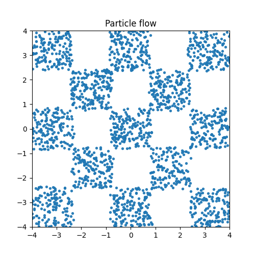

# Flow Generative Models

To run JKO flow, you will first need to install the [uv package manager](https://github.com/astral-sh/uv) and create a virtual environment:

```bash
uv venv
source .venv/bin/activate
```

Then, either run:

- `uv run jko_iflow.py` to train a JKO-model  
- `uv run ot_flow.py` to train a Flow-OT model  

---

## JKO-iFlow
Implementation adapted from [hamrel-cxu/JKO-iFlow](https://github.com/hamrel-cxu/JKO-iFlow).

This is a proof of concept; performance can definitely be improved a little. Training should take < 10 mins on an A10 GPU.

<p float="left">
  
  
  
</p>

*Left: target distribution. Right: generated samples.*

---

## Flow-OT
Implementation adapted from [hamrel-cxu/FlowOT](https://github.com/hamrel-cxu/FlowOT).

Training should take < 30 minutes on an H100 GPU.

**Flow-OT Results**

<p float="left">
  
   P trajectory" height="200"/>
  
</p>

*Left: Original distributions P and Q. Middle: Trajectory from Q → P using Flow-OT. Right: Density Ratio Estimate (DRE) using the initialized flow model.*
